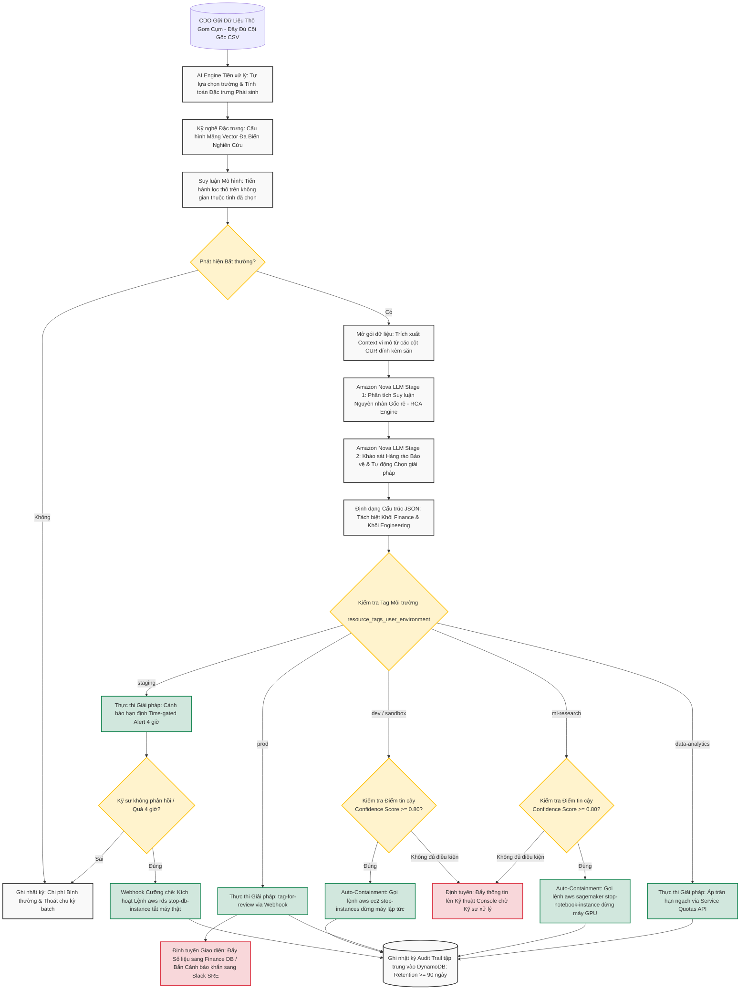

# Sơ đồ Luồng Xử lý Thuật toán FinOps Watch (Mô hình Lai IF + Amazon Nova LLM)

```mermaid
graph TD
    %% Định nghĩa phong cách đồ họa
    classDef process fill:#f9f9f9,stroke:#333,stroke-width:2px;
    classDef condition fill:#fff3cd,stroke:#ffc107,stroke-width:2px;
    classDef alert fill:#f8d7da,stroke:#dc3545,stroke-width:2px;
    classDef action fill:#d1e7dd,stroke:#198754,stroke-width:2px;

    %% Giai đoạn Nạp dữ liệu Raw 100% cột từ CDO
    A[(CDO Gửi Dữ Liệu Thô Gom Cụm - Đầy Đủ Cột Gốc CSV)] --> B[AI Engine Tiền xử lý: Tự lựa chọn trường & Tính toán Đặc trưng Phái sinh]:::process
    B --> C[Kỹ nghệ Đặc trưng: Cấu hình Mảng Vector Đa Biến Nghiên Cứu]:::process
    
    %% Giai đoạn Phát hiện (Detection Stage - Isolation Forest / Heuristic)
    C --> D[Suy luận Mô hình: Tiến hành lọc thô trên không gian thuộc tính đã chọn]:::process
    D --> E{Phát hiện Bất thường?}:::condition
    E -- Không --> F[Ghi nhật ký: Chi phí Bình thường & Thoát chu kỳ batch]:::process
    
    %% Giai đoạn GenAI Trí tuệ Nhân tạo (Amazon Nova Multi-Stage)
    E -- Có --> G[Mở gói dữ liệu: Trích xuất Context vi mô từ các cột CUR đính kèm sẵn]:::process
    
    %% (Các phần hạ tầng kịch bản can thiệp bên dưới giữ nguyên...)
    G --> H[Amazon Nova LLM Stage 1: Phân tích Suy luận Nguyên nhân Gốc rễ - RCA Engine]:::process
    H --> I[Amazon Nova LLM Stage 2: Khảo sát Hàng rào Bảo vệ & Tự động Chọn giải pháp]:::process
    I --> K[Định dạng Cấu trúc JSON: Tách biệt Khối Finance & Khối Engineering]:::process
    K --> J{Kiểm tra Tag Môi trường <br> resource_tags_user_environment}:::condition
    J -- prod --> L[Thực thi Giải pháp: tag-for-review via Webhook]:::action
    L --> M[Định tuyến Giao diện: Đẩy Số liệu sang Finance DB / Bắn Cảnh báo khẩn sang Slack SRE]:::alert
    J -- staging --> N[Thực thi Giải pháp: Cảnh báo hạn định Time-gated Alert 4 giờ]:::action
    N --> O{Kỹ sư không phản hồi / Quá 4 giờ?}:::condition
    O -- Đúng --> P[Webhook Cưỡng chế: Kích hoạt Lệnh aws rds stop-db-instance tắt máy thật]:::action
    O -- Sai --> F
    J -- dev / sandbox --> Q{Kiểm tra Điểm tin cậy <br> Confidence Score >= 0.80?}:::condition
    Q -- Đúng --> R[Auto-Containment: Gọi lệnh aws ec2 stop-instances dừng máy lập tức]:::action
    Q -- Không đủ điều kiện --> S[Định tuyến: Đẩy thông tin lên Kỹ thuật Console chờ Kỹ sư xử lý]:::alert
    J -- ml-research --> U{Kiểm tra Điểm tin cậy <br> Confidence Score >= 0.80?}:::condition
    U -- Đúng --> V[Auto-Containment: Gọi lệnh aws sagemaker stop-notebook-instance dừng máy GPU]:::action
    U -- Không đủ điều kiện --> S
    J -- data-analytics --> W[Thực thi Giải pháp: Áp trần hạn ngạch via Service Quotas API]:::action
    P --> T[(Ghi nhật ký Audit Trail tập trung vào DynamoDB: Retention >= 90 ngày)]:::process
    R --> T
    L --> T
    V --> T
    W --> T
```