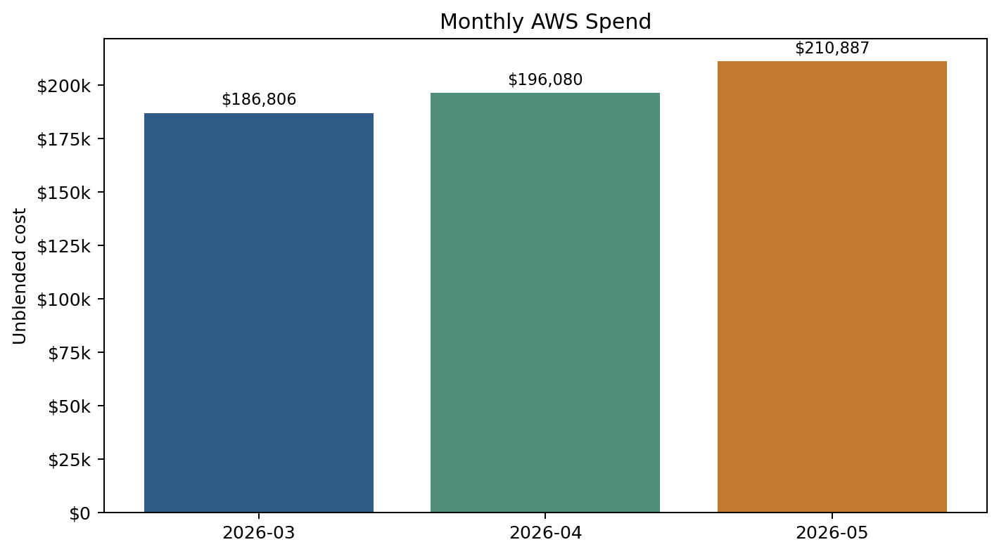
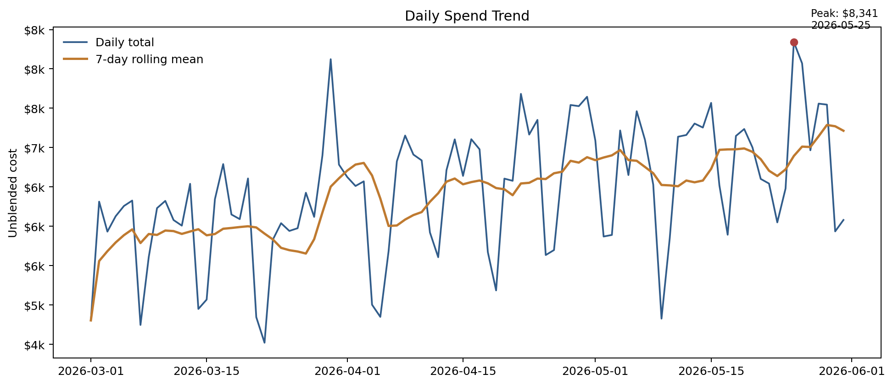
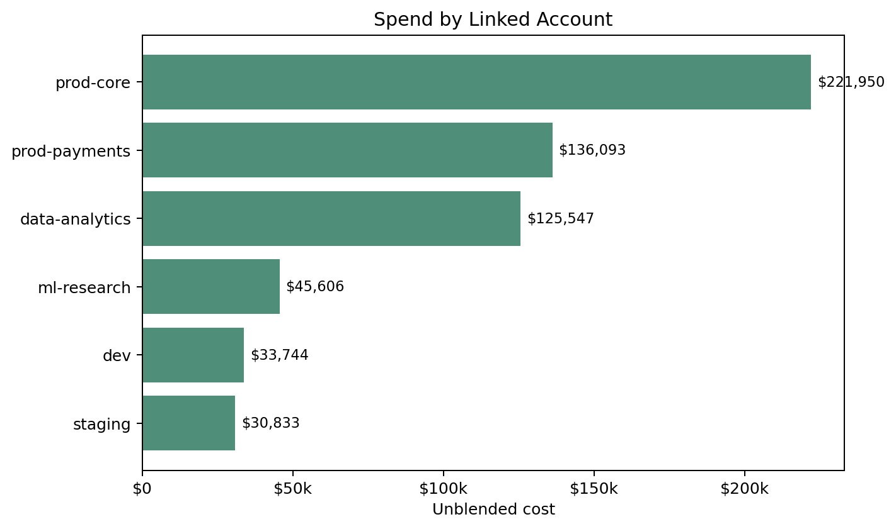
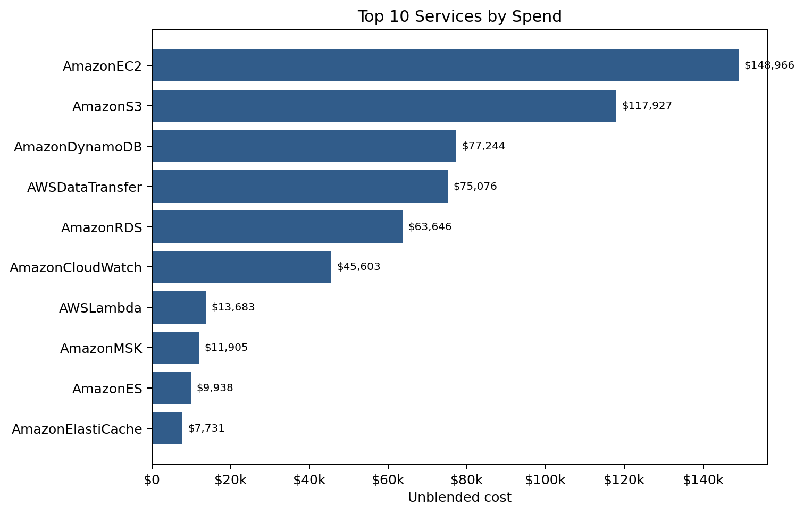
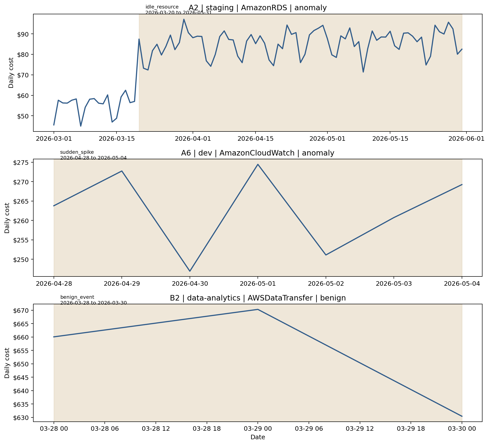
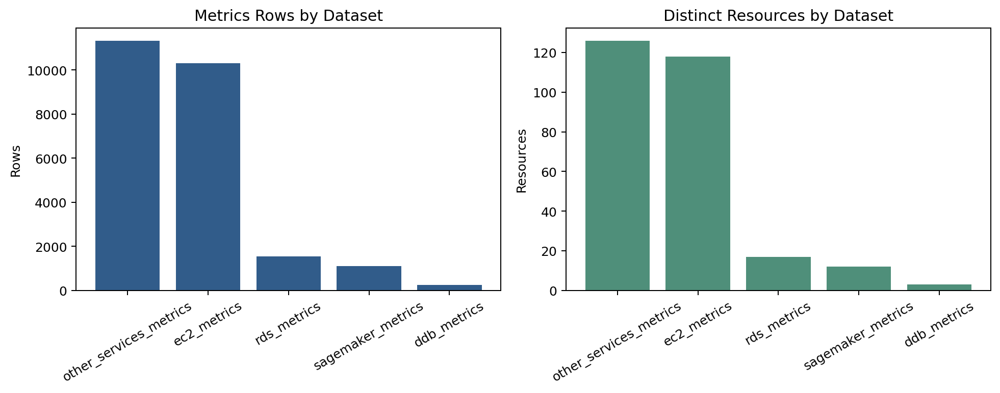

# FinOps Watch EDA Report

Repro command: `python data/eda_finops_watch.py`  
Generated assets: `docs/assets/eda/`

## Scope

This EDA focuses on the four datasets that matter most for anomaly detection design:

| File | Rows | Grain | Main use |
|---|---:|---|---|
| `data/cur_line_items.csv` | 24,533 | resource x day | Source of truth for spend and drill-down |
| `data/cost_explorer_daily.csv` | 2,770 | account x service x day | Aggregated detection surface |
| `data/anomaly_labels_public.csv` | 3 | event window | Public calibration examples only |
| `data/metrics/*.csv` | 24,533 total | resource x day | RCA and post-alert validation |

The script also writes `summary.json`, `public_label_summary.csv`, and `metrics_inventory.csv` for reuse.

## Dataset shape and coverage

- Time window is `2026-03-01` to `2026-05-31` inclusive, covering 92 days.
- The cost data spans 6 linked accounts, 17 services, 276 resources, 30 usage types, and 19 operations.
- Nearly all spend is in `us-east-1`; the only meaningful secondary region is `us-west-2` (`AmazonES`, about `$9.9k` total).
- `anomaly_labels_public.csv` contains only 2 anomaly examples and 1 benign example, so it is useful for calibration, not for supervised training.

## Spend profile

- Total spend is `$593,773.34` in CUR and `$593,773.09` in Cost Explorer. The gap is only rounding noise.
- Monthly spend climbs steadily: March `$186.8k`, April `$196.1k`, May `$210.9k`.
- Daily spend ranges from `$4.5k` to `$8.3k`, with median daily spend at `$6.5k`.
- Peak daily spend is on `2026-05-25` at `$8,341.37`.

## Concentration

- Spend is concentrated in a small number of business slices.
- `prod-core` and `prod-payments` together account for `60.3%` of total spend.
- The top 3 services (`AmazonEC2`, `AmazonS3`, `AmazonDynamoDB`) account for `57.96%`.
- The top 10 resources account for `52.49%` of total spend.
- `AmazonEC2` is both the highest-cost and highest-cardinality service, so it is the main anomaly surface.
- `AmazonS3` and `AWSDataTransfer` are high-cost with relatively few rows, which means a small number of resources can move the bill materially.

Top account totals:

| Account | Spend |
|---|---:|
| `prod-core` | `$221,950.01` |
| `prod-payments` | `$136,092.73` |
| `data-analytics` | `$125,546.80` |
| `ml-research` | `$45,606.50` |
| `dev` | `$33,744.01` |
| `staging` | `$30,833.29` |

Top service totals:

| Service | Spend |
|---|---:|
| `AmazonEC2` | `$148,965.53` |
| `AmazonS3` | `$117,927.31` |
| `AmazonDynamoDB` | `$77,244.06` |
| `AWSDataTransfer` | `$75,076.12` |
| `AmazonRDS` | `$63,645.80` |
| `AmazonCloudWatch` | `$45,603.21` |

## Data quality and operational caveats

- CUR and Cost Explorer daily totals align very closely; max absolute daily difference is only `$0.0362`. This means CE is safe as an aggregate detection surface.
- `Cost Explorer` marks the last 2 days as estimated: `2026-05-30` and `2026-05-31`, covering `$12,015.93`.
- `resource_tags_user_team` is missing on only 92 rows, but those rows belong to 1 EC2 resource worth `$13,606.23` or `2.29%` of the bill. Low row count, material cost.
- `resource_tags_user_owner` is blank on `99.63%` of rows, so owner is not a reliable routing dimension.
- Environment tags are clean and useful: `prod` dominates spend, with smaller `dev` and `staging` slices.

Important implication: tag completeness should be measured by spend, not by row count. The only untagged resource is persistent and expensive enough to become its own anomaly candidate.

## Public label patterns

- `A2` (`idle_resource`) lasts 73 days in `staging / AmazonRDS`, costing `$6,246.09` total and averaging `$85.56/day` versus a pre-event 14-day mean of `$55.49/day`. This is a long-duration drift, not a one-day spike.
- `A6` (`sudden_spike`) lasts 7 days in `dev / AmazonCloudWatch`, costing `$1,838.98` total at about `$262.71/day`. There is no prior baseline for that account-service pair.
- `B2` (`benign_event`) lasts 3 days in `data-analytics / AWSDataTransfer`, costing `$1,960.86` total. It looks like a spike but is explicitly legitimate.

This is the most important modeling signal in the public labels:

- Not every anomaly has a historical baseline.
- Not every spike is an anomaly.
- A detector that only uses rolling z-score logic at account-service level will both miss drift-like cases and overfire on planned events.

## Metrics inventory

- The combined `metrics/*.csv` row count is exactly `24,533`, the same as `cur_line_items.csv`.
- The join key `(resource_id, usage_date)` matches perfectly between cost rows and metrics rows.
- This means every spend record has a same-day telemetry record for RCA or suppression logic.

Metrics coverage by file:

| Dataset | Rows | Resources | Days |
|---|---:|---:|---:|
| `other_services_metrics` | 11,331 | 126 | 92 |
| `ec2_metrics` | 10,308 | 118 | 92 |
| `rds_metrics` | 1,545 | 17 | 92 |
| `sagemaker_metrics` | 1,104 | 12 | 92 |
| `ddb_metrics` | 245 | 3 | 92 |

One caution: these metrics files contain `label` columns. Treat them carefully to avoid leakage into backtest evaluation unless the team explicitly decides they are valid training signals.

## Detection implications

- Use `Cost Explorer` for low-latency aggregate screening, then drill into `CUR` at resource level for containment and RCA.
- Keep at least two granularities in the detector: account-service for screening, and resource-day for confirmation.
- Add special handling for new account-service pairs because some labeled cases have no prior history.
- Model drift separately from spike behavior; `A2` would be easy to miss with spike-only logic.
- Add whitelist or contextual suppression for planned bursts; `B2` is the visible false-positive trap.
- Use telemetry features from `metrics/` to suppress idle-vs-busy confusion and to justify containment actions.
