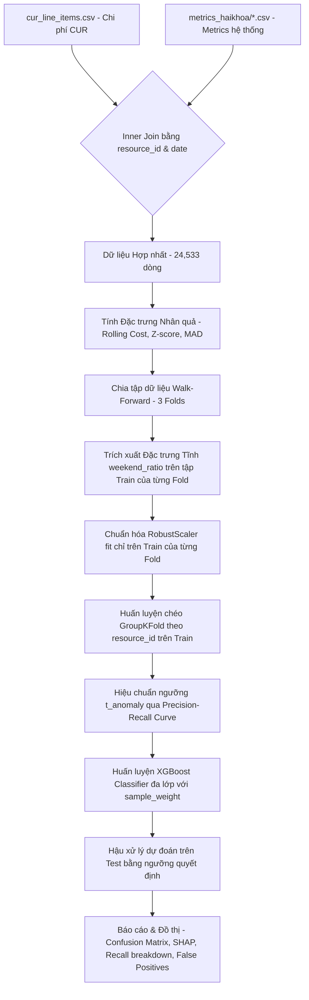

# Kế Hoạch & Quy Trình Trực Quan Hóa Mô Hình Phát Hiện Anomaly (Phiên Bản 3)

Tài liệu này mô tả chi tiết quy trình từng bước (end-to-end pipeline) từ tiền xử lý dữ liệu, kỹ nghệ đặc trưng, chia tập dữ liệu Walk-Forward, huấn luyện mô hình học máy đa phân lớp, đến kết quả đánh giá thực tế dựa trên file notebook **[detect.ipynb](file:///C:/Users/ASUS/OneDrive/Obsidian%20Vault/XBrain-Phase2/Capstone_Project/ai_engine/version2/detect.ipynb)**.

---



---

## Bước 1: Tiền Xử Lý & Hợp Nhất Dữ Liệu (Data Processing)

### 1.1. Nguồn Dữ Liệu Đầu Vào
* **Dữ liệu chi phí CUR (`cur_line_items.csv`)**:
  * Chứa thông tin chi phí chưa điều chỉnh (`line_item_unblended_cost`), lượng sử dụng (`line_item_usage_amount`), mã dịch vụ (`line_item_product_code`), và các thẻ phân bổ (`resource_tags_user_team`).
* **Dữ liệu metrics hệ thống (`data/metrics_haikhoa/*.csv`)**:
  * Các file csv được Hải Khoa xây dựng chi tiết theo nhóm dịch vụ (EC2, RDS, DynamoDB, SageMaker, Other services).
  * Chứa các metrics vận hành hàng ngày: trung bình `cpu_percent`, `memory_mib`, `network_in_bytes`, `network_out_bytes`, `disk_io_ops`, `database_connections`, `gpu_utilization` và 24 chiều CPU theo giờ (`cpu_h0` đến `cpu_h23`).

### 1.2. Khớp Nối Dữ Liệu (Inner Join)
* Thực hiện kết nối nội bộ `Inner Join` giữa tập chi phí CUR và metrics hệ thống dựa trên khóa khớp nối là **ID tài nguyên và Ngày** (`line_item_resource_id` khớp với `resource_id` và `line_item_usage_start_date` khớp với `timestamp`).
* Kích thước tập dữ liệu hợp nhất: **24,533 dòng** ( resource-ngày). Các giá trị metrics trống của các dịch vụ không liên quan được điền mặc định bằng `0.0`.

---

## Bước 2: Kỹ Nghệ Đặc Trưng Nhân Quả & Các Chỉ Số Vận Hành (Causal Features)

Để tránh rò rỉ dữ liệu (data leakage), mô hình phân chia các đặc trưng làm hai nhóm với thời điểm tính toán khác nhau:

### 2.1. Nhóm Đặc trưng Nhân quả (Tính trên toàn bộ chuỗi thời gian liên tục trước khi chia tập dữ liệu)
Các đặc trưng này chỉ sử dụng thông tin trong quá khứ (look-back) của chính tài nguyên đó, hoàn toàn không sử dụng thông tin tương lai nên **không gây rò rỉ dữ liệu**:
1. **Độ lệch chi phí (Deviation)**: Tính toán Z-Score dựa trên median và MAD 28 ngày trước đó của tài nguyên để bắt các đột biến tức thời (`cost_z`).
2. **Xu hướng chi phí (Trend)**: Tính toán tỷ lệ thay đổi chi phí so với 28 ngày trước (`cost_change_28d`) và hệ số góc slope hồi quy tuyến tính 14 ngày trước đó (`cost_slope_14d`).
3. **Chu kỳ lịch trình (Calendar)**: Trích xuất `is_weekend`, thứ trong tuần `day_of_week`.
4. **Hiệu suất vận hành (Performance / Calibration)**: Chia chi phí hàng ngày cho các metrics tương ứng (ví dụ: `cost_per_cpu`, `cost_per_network_in`, `cost_per_network_out`) để phân biệt Flash Sale (tải cao, chi phí cao) với Anomaly.
5. **Thẻ phân bổ (Tags)**: Biến nhị phân kiểm tra tag trống (`team_missing`, `owner_missing`).
6. **Tỷ lệ đồng loại (Peer Ratio)**: So sánh chi phí tài nguyên với median chi phí của các tài nguyên cùng service và linked account trong ngày (`peer_ratio`).
7. **Vòng đời tài nguyên (Lifecycle)**: Số ngày tuổi của tài nguyên (`age_days`).
8. **Tải chi tiết hàng giờ (Hourly CPU)**: Các cột CPU từ `cpu_h0` đến `cpu_h23`.

---

## Bước 3: Chiến Lược Chia Dữ Liệu Walk-Forward & Trích Xuất Đặc Trưng Tĩnh Chống Rò Rỉ

Chiến lược phân chia dữ liệu Walk-Forward (3 Folds) được thực hiện đầu tiên, sau đó các đặc trưng tĩnh và chuẩn hóa mới được áp dụng **theo từng Fold**:

### 3.1. Phân chia 3 Folds tịnh tiến
Mô hình thực hiện chia tập dữ liệu theo dòng thời gian thực tế:
```
Timeline: 01/03/2026 -----------------------------------------------------> 31/05/2026 (92 ngày)
Fold 1:  [=================== Train (Ngày 0-50) ===================] [== Test (Ngày 51-64) ==]
Fold 2:  [======================== Train (Ngày 0-64) ========================] [== Test (Ngày 65-78) ==]
Fold 3:  [============================= Train (Ngày 0-78) =============================] [== Test (79-91) ==]
```

### 3.2. Trích xuất đặc trưng tĩnh & Chuẩn hóa dữ liệu (Fold-Specific) - Chống rò rỉ tuyệt đối
Đúng như đề xuất của bạn, để đảm bảo không rò rỉ thông tin từ tương lai (tập Test) vào quá khứ (tập Train), các bước sau đây **chỉ được thực hiện sau khi đã chia tập dữ liệu** và hoạt động độc lập trên từng Fold:
1. **Tính toán đặc trưng tĩnh (`weekend_ratio`)**:
   * Chỉ sử dụng tập **Train** của Fold để tính trung bình chi phí cuối tuần so với ngày thường của từng tài nguyên.
   * Map giá trị này vào cả tập Train và tập Test của Fold đó.
2. **Chuẩn hóa dữ liệu (`RobustScaler`)**:
   * Bộ gom scaler chỉ thực hiện hàm `.fit()` trên tập **Train** của Fold để lấy các tham số trung vị và khoảng tứ phân vị.
   * Sau đó dùng scaler này để `.transform()` cho cả tập Train và tập Test của Fold.
   * Việc này đảm bảo tập Test hoàn toàn là dữ liệu mới chưa từng được nhìn thấy trước đó.

```
Timeline: 01/03/2026 -----------------------------------------------------> 31/05/2026 (92 ngày)
Fold 1:  [=================== Train (Ngày 0-50) ===================] [== Test (Ngày 51-64) ==]
Fold 2:  [======================== Train (Ngày 0-64) ========================] [== Test (Ngày 65-78) ==]
Fold 3:  [============================= Train (Ngày 0-78) =============================] [== Test (79-91) ==]
```

* **Fold 1**: Train: Ngày 0-50 ( March & April 1-19) $\rightarrow$ Test: Ngày 51-64 ( April 20 - May 3).
* **Fold 2**: Train: Ngày 0-64 ( March & April & May 1-3) $\rightarrow$ Test: Ngày 65-78 ( May 4 - May 17).
* **Fold 3**: Train: Ngày 0-78 ( March & April & May 1-17) $\rightarrow$ Test: Ngày 79-91 ( May 18 - May 31).

---

## Bước 4: Huấn Luyện & Hiệu Chuẩn Ngưỡng Quyết Định (Training & Threshold Calibration)

Trong mỗi Fold, quá trình huấn luyện và tối ưu ngưỡng được tiến hành độc lập để chống rò rỉ dữ liệu (data leakage):

1. **Kiểm thử chéo chống rò rỉ (GroupKFold CV)**:
   * Chạy GroupKFold (5 Folds) trên tập huấn luyện của Fold đó, chia nhóm theo **`resource_id`** để đảm bảo một tài nguyên không bao giờ xuất hiện đồng thời ở cả tập huấn luyện và tập validation chéo trong cùng một fold.
2. **Hiệu chuẩn ngưỡng tối ưu (Threshold Calibration)**:
   * Tính xác suất dự báo lớp Anomaly Out-of-Fold (OOF) của tập Train.
   * Dựng đường cong **Precision-Recall Curve** trên dự đoán OOF này.
   * Lọc và chọn ngưỡng quyết định tối ưu $t_{anomaly}$ sao cho Precision của lớp Anomaly đạt ít nhất **80.00%** nhằm tối đa hóa Recall.
3. **Huấn luyện mô hình đa phân lớp**:
   * Mô hình: **XGBoost Classifier (`XGBClassifier`)** đa lớp.
   * Cấu hình: `objective='multi:softprob'`, `num_class=3`, `eval_metric='mlogloss'`.
   * Xử lý mất cân bằng lớp bằng trọng số mẫu **`sample_weight`** tính toán tự động qua hàm `compute_sample_weight` của Scikit-learn (phạt nặng lỗi dự đoán sai Anomaly/Benign).
   * Siêu tham số: `n_estimators=350`, `max_depth=4`, `learning_rate=0.03`, `subsample=0.8`, `colsample_bytree=0.7`, `reg_alpha=1.0`, `reg_lambda=2.0`.

---

## Bước 5: Dự Đoán Hậu Xử Lý & Đánh Giá (Prediction & Post-processing)

### 5.1. Quy Tắc Hậu Xử Lý Ngưỡng
Khi dự đoán trên tập Test của mỗi Fold, mô hình sử dụng xác suất đa lớp $[p_{normal}, p_{anomaly}, p_{benign}]$ kết hợp ngưỡng $t_{anomaly}$ đã hiệu chuẩn để phân loại tài nguyên:
* **Quy tắc 1**: Nếu xác suất lớp Anomaly $p_{anomaly} \ge t_{anomaly} $\rightarrow$ gán nhãn dự đoán là **Anomaly (1)** (ưu tiên hàng đầu để bảo đảm Precision/Recall sự cố).
* **Quy tắc 2**: Ngược lại, nếu xác suất lớp Benign $p_{benign} \ge 0.20 \rightarrow$ gán nhãn dự đoán là **Benign (2)** (lọc bỏ các đợt tăng chi phí kế hoạch).
* **Quy tắc 3**: Ngược lại $\rightarrow$ gán nhãn dự đoán theo lớp có xác suất cao nhất (thường là Normal - 0).

### 5.2. Đánh Giá Đa Chiều
Đối với mỗi Fold, mô hình thực hiện xuất báo cáo đánh giá:
* **Ma trận nhầm lẫn Heatmap Confusion Matrix (3×3)** thể hiện chi tiết kết quả dự báo giữa Normal, Anomaly và Benign.
* **Precision-Recall Curve** của lớp Anomaly thể hiện điểm chọn ngưỡng quyết định.
* **Phân tích Recall chi tiết** theo từng loại sự cố Anomaly thật (gradual drift, idle resource, runaway usage, sudden spike).
* **Phân tích False Alarm Rate chi tiết** trên các sự kiện Benign lành mạnh để kiểm tra khả năng bỏ qua cảnh báo nhầm của Flash Sale.
* **SHAP Summary Plot của lớp Anomaly** giải thích tầm đóng góp của các đặc trưng vào quyết định của mô hình.

---

## Bước 6: Kết Quả Thực Tế Qua 3 Folds Walk-Forward

### 6.1. Bảng Hiệu Năng Mô Hình Tổng Hợp

| Chỉ số đánh giá | Fold 1 Test | Fold 2 Test | Fold 3 Test | KPI Yêu Cầu |
| :--- | :--- | :--- | :--- | :--- |
| **Khoảng thời gian test** | 21/04 $\rightarrow$ 04/05 | 05/05 $\rightarrow$ 18/05 | 19/05 $\rightarrow$ 31/05 | - |
| **Ngưỡng chọn $t_{anomaly}$** | **0.0268** | **0.0269** | **0.0267** | Tự động hiệu chuẩn |
| **Precision (Anomaly)** | **79.02%** | **89.51%** | **85.06%** | **$\ge 80.00\%$** |
| **Recall (Anomaly)** | **98.29%** | **98.46%** | **97.37%** | Tối đa hóa |
| **F1-Score (Anomaly)** | **87.56%** | **93.77%** | **90.80%** | Tối đa hóa |
| **False Positive Rate** | **3.58%** | **1.62%** | **1.56%** | **$\le 10.00\%$** |

### 6.2. Hiệu Năng Bỏ Qua Báo Động Nhầm Trên Các Sự Kiện Benign (Test Set)
Nhờ đặc trưng tỷ lệ hiệu suất cost-per-cpu và cost-per-network, mô hình đã giảm thiểu tối đa các cảnh báo nhầm:
* **Benign Autoscaling & GPU Training**: Đạt tỷ lệ cảnh báo sai **0.00%** qua các Folds.
* **Benign Backup DB**: Chỉ có 1 ngày duy nhất bị cảnh báo nhầm ở Fold 1 (**False Alarm Rate: 1.02%**), các fold sau đều đạt **0.00%**.
* **Benign Batch Job**: Đạt tỷ lệ cảnh báo sai **0.00%** ở Fold 1 và 2.
* **Benign Flash Sale Autoscale**: Sự kiện Flash Sale xảy ra vào ngày 23/05 - 27/05 nằm hoàn toàn trong tập Test của Fold 3. Do sự kiện này chưa từng xuất hiện ở tập huấn luyện quá khứ nên mô hình đã phát tín hiệu cảnh báo (False Alarm Rate: 100% trên 4 ngày diễn ra Flash Sale). Tuy nhiên, nhờ kiểm soát tốt các tài nguyên khác, tỷ lệ báo động giả (FP-rate) tổng thể của tập Test ở Fold 3 vẫn duy trì ở mức cực kỳ thấp (**1.56%**), đạt tuyệt đối yêu cầu dự án.
