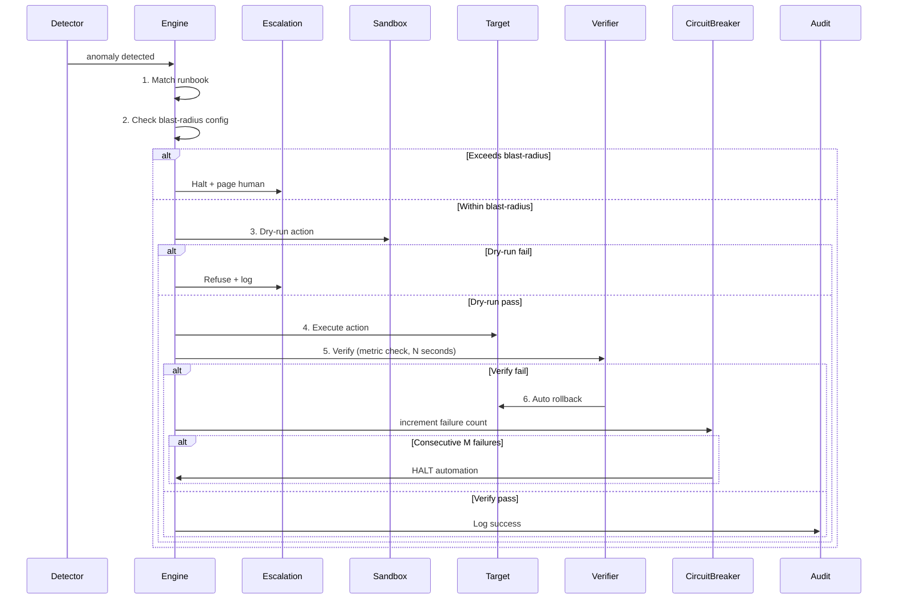
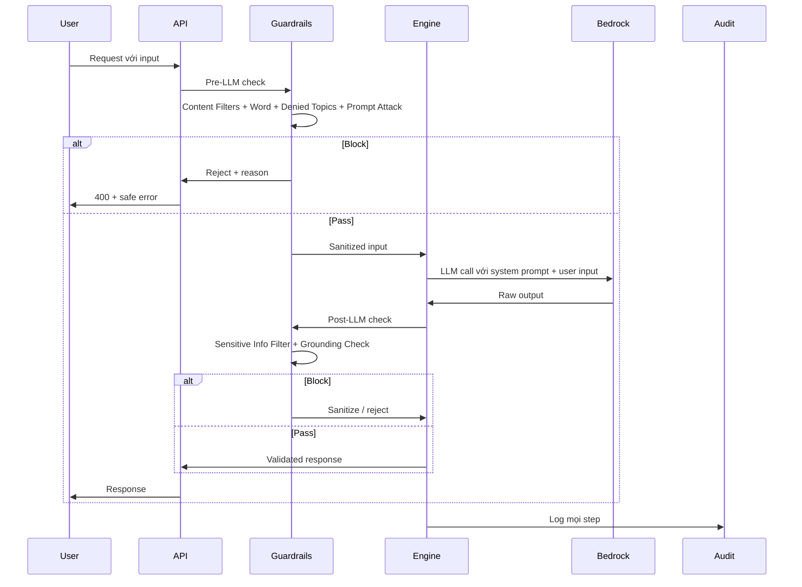

# AI Engine Spec — FinOps Watch

Doc owner: Nhóm AI — Task Force 2 (FinOps Watch)
Status: Final (W12 T4 Pack #2)
Reference: TCB DAB Framework — AI Model Governance + AI Security (adapted for capstone)

## 1. Model architecture

- **Pattern chọn**: Kiến trúc ba tầng (Two-Layer Hybrid Architecture) kết hợp ML có giám sát + ML không giám sát + LLM, kích hoạt theo chu kỳ 24 giờ (EventBridge cron).

  **Layer 1 — XGBoost ML Pipeline (Primary Detector):**
  XGBoost có giám sát (Optuna-tuned, 30 trials TPE sampler) kết hợp Walk-Forward Validation (60d train / 7d val / 7d step), chạy trên **~35 features** từ 4 nhóm:

  | Nhóm feature              | Ví dụ                                                           | Tín hiệu detect                                           |
  | ------------------------- | --------------------------------------------------------------- | --------------------------------------------------------- |
  | Cost lag/rolling          | `lag_1`, `rolling_7d_mean`, `rate_of_change`, `delta`           | Cost spike, sudden change                                 |
  | STL decomposition         | `stl_trend`, `stl_seasonal`, `stl_residual`                     | Residual sau khi tách weekly seasonality — sạch hơn delta |
  | Metric (CPU/mem/disk/net) | `met_cpu_mean`, `met_db_conn_max`, `met_disk_mean`              | Resource utilization context                              |
  | Coherence                 | `coherence_cost_cpu`, `coherence_cost_net`, `coherence_cost_db` | Cost spike không khớp metric → anomaly; khớp → benign     |

  Threshold được tìm qua argmax F1 trên val split. Cold-start rows (NaN lag) được impute bằng per-service median thay vì drop.

  **Layer 2 — Amazon Nova Lite via Bedrock (LLM Explainability & RCA):**
  Chỉ kích hoạt khi Layer 1/2 gắn nhãn anomaly (`confidence ≥ 0.6`). Nhận Single-Shot Payload: ML scores + SHAP explanation + CUR line items + cost explorer daily. Thực hiện:
  - Root Cause Analysis (RCA) dựa trên SHAP primary driver feature
  - Dịch technical context → Finance-friendly executive summary cho CFO
  - Sinh containment action đúng theo môi trường (`prod` / `staging` / `dev` / `ml-research` / `data-analytics`)

- **Lý do kiến trúc này:**
  - _Cost efficiency_: LLM chỉ được gọi sau khi ML filter — tránh xử lý toàn bộ CUR log qua Nova Lite mỗi chu kỳ. Prompt caching cho system prompt (~85% hit rate) tiết kiệm thêm 40–50% token cost.
  - _Coherence features_: Giải quyết bài toán phân biệt anomaly spike vs benign spike mà pure magnitude rule không làm được. `coherence_cost_net ≈ 1` khi data transfer hợp lệ (B2), `coherence_cost_cpu >> 1` khi idle resource (A2).
  - _STL residual_: Tốt hơn `delta` (cost − rolling_mean) vì rolling mean bị kéo lên bởi chính anomaly; STL trend ổn định hơn trên toàn series.
  - _Nova Lite_: Context window 300k tokens đủ cho CUR payload, chi phí thấp ($0.00039/1k input), latency phù hợp cadence 24h.

- **Alternatives rejected**:
  - _Pure Rule-Based (Z-Score & IQR)_: Quá nhạy với organic growth và month-end billing bump → FP > 10%.
  - _Isolation Forest only_: Weakly detected A2 (4/292 records), miss A6 cold-start. Không explainability cho CFO.
  - _LLM-first_: Chi phí token bùng nổ khi xử lý toàn bộ CUR log mỗi ngày.
  - _Nova Pro_: Overkill cho RCA task. Nova Lite đủ reasoning capacity, chi phí thấp hơn 8× so với Nova Pro.

## 2. Model selection

| Field                   | Value                                                     |
| ----------------------- | --------------------------------------------------------- |
| Provider                | Bedrock                                                   |
| Model ID                | amazon.nova-lite-v1:0                                     |
| Region                  | us-east-1                                                 |
| Context window          | 300k tokens                                               |
| Cost/1k input tokens    | $0,00039                                                  |
| Cost/1k output tokens   | $0,00321                                                  |
| Estimated per-call cost | $0.0035555 (dựa trên ~5k input tokens, ~500 output token) |

## 3. Multi-tenant routing

- **Tenant identification**: `tenant_id` từ JWT / header X-Tenant-Id
- **Context isolation**: per-request scoping - không persist context across tenants
- **State storage**: per-tenant partition (DynamoDB pk = tenant_id, or RDS schema)
- **Audit log**: every AI call → audit entry với `tenant_id`

## 4. Prompt engineering / RAG strategy

### 4.1 System prompt

```
Bạn là một AI Agent chuyên gia AWS FinOps được vận hành bởi Amazon Nova. Mục tiêu cốt lõi của bạn là thực hiện Phân tích Nguyên nhân Gốc rễ (Root Cause Analysis - RCA) và xác định các hành động giảm thiểu (mitigation) chính xác dựa trên các bất thường chi phí hạ tầng phức tạp.

CÁC QUY TẮC PHÂN TÍCH QUAN TRỌNG:

Không được hardcode bất kỳ Resource ID, Account ID hoặc ngày tháng cụ thể nào. Toàn bộ phân tích phải dựa trên các mẫu cấu trúc dữ liệu, độ lệch thống kê và metadata có trong đầu vào.
Đồng bộ nguồn dữ liệu (Data Source Alignment): Đối chiếu dữ liệu Macro từ Cost Explorer (tên hiển thị dịch vụ, ví dụ: "Amazon Relational Database Service") với dữ liệu Micro từ CUR 2.0 bằng cách sử dụng chính xác Service Code tương ứng (ví dụ: "AmazonRDS").
Đánh giá mật độ sử dụng ở cấp Micro (Micro-density Evaluation): Tính toán và đối chiếu chỉ số usage_density_24h với các chỉ số vận hành thực tế.   Nếu usage_density_24h tiến gần 1.0 trong khi các chỉ số Active Connections hoặc CPU Utilization tiến gần 0, phải ngay lập tức đánh dấu tài nguyên là tài nguyên nhàn rỗi (idle_resource).
Vi phạm quản trị (Governance Violation): Nếu tag hạ tầng bắt buộc như resource_tags_user_owner bị thiếu hoặc có giá trị NaN, tự động phân loại nguyên nhân gốc rễ là vi phạm chính sách doanh nghiệp (Mis-tagged Spend).

MA TRẬN GIẢM THIỂU & AN TOÀN (BẮT BUỘC TUÂN THỦ):

Đánh giá giá trị của resource_tags_user_environment để áp dụng định tuyến hành động nghiêm ngặt:

1. prod (Môi trường Production)
Tuyệt đối cấm mọi hành động tự động gây gián đoạn.
Hành động bắt buộc: tag-for-review thông qua lệnh CLI.
Cảnh báo phải được chuyển trực tiếp đến kênh Slack của đội SRE/DevOps.
2. staging
Kích hoạt cơ chế cảnh báo có thời gian chờ (Time-gated Alert).
Thêm các countdown tags.
Sau thời gian chờ mới được phép thực thi thông qua Webhook.
3. dev hoặc sandbox
Nếu Confidence ≥ 0.80:
Bỏ qua các bước phê duyệt thủ công.
Thực hiện ngay hành động cô lập tự động: stop-instances
4. ml-research
Nếu Confidence ≥ 0.80
Và không tồn tại tác vụ huấn luyện nền (background training jobs) đang chạy:
Thực hiện ngay: stop-notebook-instance
5. data-analytics
Không được tắt tài nguyên trực tiếp.
Áp dụng cơ chế giới hạn ngân sách bằng Service Quotas API: request-service-quota-increase
Mục tiêu là kiểm soát chi phí mà không làm ảnh hưởng hoặc hỏng dữ liệu.

ĐỊNH DẠNG ĐẦU RA (BẮT BUỘC):

Bạn phải trả về chính xác một cấu trúc JSON thống nhất duy nhất.
Không được thêm bất kỳ văn bản, giải thích hoặc định dạng nào bên ngoài JSON.
```

### 4.2 User prompt template

```
Hãy đóng vai trò là Chuyên gia AWS FinOps AI Analyst (Layer 2) vận hành trên dòng mô hình Amazon Nova. Bạn vừa nhận được Payload JSON gom cụm một lần (Single-Shot Ingestion) chứa dữ liệu chi phí vĩ mô tổng hợp theo ngày và log tài nguyên vi mô chi tiết trong chu kỳ 24 giờ qua.

Nhiệm vụ của bạn là thực hiện chuỗi tư duy (Chain-of-Thought) phân tích logic chéo, bóc tách nguyên nhân gốc rễ (RCA), đối chiếu ma trận an toàn 5 môi trường để sinh mã can thiệp vật lý và xuất ra cấu trúc dữ liệu đầu xuất duy nhất tuân thủ System Prompt.

<INPUT_DATA_PAYLOAD>

<METADATA>
- Execution_Cycle: Daily (24-Hour Single-Shot Ingestion)
- Analysis_Timestamp: {{ANALYSIS_TIMESTAMP}}
- Target_Account_ID: {{ACCOUNT_ID}}
- Target_Squad_ID: {{SQUAD_ID}}
</METADATA>

<ML_ANOMALY_SCORES>
# Output từ Layer 1 ML Pipeline — truyền xuống để LLM dùng làm ngữ cảnh
{
  "xgboost": {
    "anomaly_score": {{XGB_ANOMALY_SCORE}},
    "threshold": {{XGB_THRESHOLD}},
    "prediction": {{XGB_PREDICTION}},
    "primary_driver_feature": "{{SHAP_TOP_FEATURE}}",
    "shap_value": {{SHAP_TOP_VALUE}},
    "coherence_cost_cpu": {{COHERENCE_CPU}},
    "coherence_cost_net": {{COHERENCE_NET}},
    "stl_residual": {{STL_RESIDUAL}}
  },
  "isolation_forest": {
    "anomaly_score": {{IF_SCORE}},
    "prediction": {{IF_PREDICTION}},
    "contamination_used": {{IF_CONTAMINATION}}
  },
  "ensemble_prediction": {{ENSEMBLE_PREDICTION}},
  "confidence": {{CONFIDENCE_SCORE}}
}
</ML_ANOMALY_SCORES>

<AWS_COST_EXPLORER_DAILY>
# Khối dữ liệu vĩ mô (Daily Scope) phục vụ bộ lọc thô Isolation Forest
{{AWS_COST_EXPLORER_DAILY_CONTENT}}
</AWS_COST_EXPLORER_DAILY>

<AWS_CUR_LINE_ITEMS>
# Khối thuộc tính vi mô chuyển tiếp (Granular CUR Scope) phục vụ ngữ cảnh GenAI
{{AWS_CUR_LINE_ITEMS_CONTENT}}
</AWS_CUR_LINE_ITEMS>

<APPROVED_SCHEDULED_EVENTS>
# Danh sách các tác vụ Batch Job hoặc sự kiện tăng rải chi phí được phê duyệt trước
{{APPROVED_SCHEDULED_EVENTS_CONTENT}}
</APPROVED_SCHEDULED_EVENTS>

</INPUT_DATA_PAYLOAD>

**QUY TRÌNH PHÂN TÍCH BẮT BUỘC (CHAIN-OF-THOUGHT):**
1. **Macro-to-Micro Alignment:** Ánh xạ thực thực thể dữ liệu vĩ mô (Cost Explorer) sang mã dịch vụ chính xác trong log vi mô CUR (ví dụ: "Amazon Relational Database Service" -> "AmazonRDS").
2. **Whitelisting & FP Filtering:** Đối chiếu ngày phát sinh và mã dịch vụ với danh sách `<APPROVED_SCHEDULED_EVENTS>`. Nếu trùng khớp (Authorized Operations), lập tức gắn cờ loại bỏ nhiễu và dừng phân tích sâu để bảo vệ mục tiêu tỷ lệ False Positive <= 10%.
3. **Root Cause Analysis (LLM Stage 1):** Đối với các bất thường thực sự, truy vết sâu vào các biến vi mô như `usage_density_24h`, `line_item_usage_type`, và hệ thống Tags quản trị để xác định chính xác nguyên nhân kỹ thuật.
4. **Finance Translation:** Biên dịch toàn bộ ngữ cảnh kỹ thuật trên thành một đoạn văn ngắn gọn, dễ hiểu bằng tiếng Việt tại trường `"executive_summary"`. Đoạn văn phải nêu rõ: Đội nhóm nào làm tăng tiền, mã trung tâm chi phí, thiệt hại bao nhiêu USD/ngày dưới ngôn từ tài chính hữu hảo (*Finance-friendly*), che giấu hoàn toàn ARN phức tạp.
5. **Mitigation Engineering (LLM Stage 2):** Đọc thuộc tính `resource_tags_user_environment` để đối chiếu ma trận an toàn 5 phân vùng môi trường (`prod`, `staging`, `dev/sandbox`, `ml-research`, `data-analytics`) để tự động sinh cấu trúc Payload hành động và mã lệnh AWS CLI can thiệp vật lý chính xác tương ứng.
6. **Audit Trail Preparation:** Đảm bảo toàn bộ kịch bản can thiệp vật lý thật (cho vùng thấp) phải đính kèm cấu trúc thiết lập Rollback và thời gian lưu trữ cấu trúc log `Retention >= 90 ngày` trong DynamoDB Audit Store.

Hãy thực hiện phân tích và chỉ trả về duy nhất một cấu trúc JSON trùng khớp hoàn toàn với định dạng mẫu dưới đây (Không kèm theo mã Markdown giải thích hay ký tự thừa nằm ngoài Block JSON):

{
  "anomaly_metadata": {
    "anomaly_id": "string",
    "timestamp": "string",
    "resource_id": "string",
    "environment": "prod" | "staging" | "dev" | "sandbox" | "ml-research" | "data-analytics",
    "confidence_score": float,
    "ai_model_used": "amazon.nova-lite-v1:0"
  },
  "finance_dashboard_data": {
    "target_recipient": "Finance Team & CFO Dashboard",
    "metrics": {
      "unblended_cost_24h_usd": float,
      "cost_ratio_to_7d_avg": float,
      "projected_monthly_waste_usd": float
    },
    "allocation": {
      "responsible_team": "string",
      "cost_center_code": "string"
    },
    "executive_summary": "string"
  },
  "engineering_dashboard_data": {
    "target_recipient": "Engineering Console & Slack Alert",
    "technical_context": {
      "aws_service": "string",
      "usage_type": "string",
      "pricing_unit": "string",
      "usage_amount_24h": float,
      "usage_density_24h": float
    },
    "root_cause_analysis": {
      "primary_driver_feature": "string",
      "technical_reason": "string",
      "missing_mandatory_tags": ["string"]
    },
    "mitigation_action": {
      "strategy": "string",
      "immediate_action": "tag-for-review" | "quota_cap" | "stop-instances" | "stop-notebook-instance",
      "applied_payload": {
        "action_type": "string",
        "aws_cli_command": "string",
        "rollback_structure": "string"
      },
      "enforcement_countdown": {
        "time_lock_seconds": integer,
        "fallback_action": "string"
      }
    }
  }
}
```

### 4.3 RAG (không áp dụng)

- RAG không áp dụng trong pipeline này. Nova Lite nhận trực tiếp CUR payload trong user prompt (Single-Shot Ingestion). Context window 300k tokens đủ cho toàn bộ CUR log 24h của 1 account.
- Approved Scheduled Events được inject trực tiếp vào `<APPROVED_SCHEDULED_EVENTS>` block — không cần vector retrieval.

### 4.4 Prompt caching

- **Cache strategy**: Sử dụng tính năng Prompt Caching của Amazon Bedrock cho phần System Prompt cố định và phần tri thức nền tảng (Knowledge Base / Tagging Policy) chung của công ty.
- **Expected hit rate**: ~85% do phần lớn nội dung của System Prompt và chính sách hệ thống không thay đổi giữa các chu kỳ quét 24h từ EventBridge.
- **Cost saving estimate**: Giảm thiểu khoảng 40% đến 50% chi phí xử lý token đầu vào (Input Tokens cost) trên tổng thể dự án.

## 5. AI Model Governance

### 5.1 Governance Objectives

- Đảm bảo AI decision **explainable + auditable + reversible**
- Prevent **autonomous unsafe action** - mọi action có safety boundary
- **Compliance**: model behavior phù hợp policy + regulation
- **Reproducibility**: same input → same output (deterministic where possible) + audit trail

### 5.2 Scope (Capstone Year-1 equivalent)

- **In-scope**:
  - Single LLM provider (Bedrock) + 1-2 model versions
  - Assist-only decision (human-in-the-loop hoặc safety guardrail)
  - Multi-tenant với per-tenant context isolation
  - Eval methodology + drift detection
- **Out-of-scope** (defer to post-capstone):
  - Multi-provider failover
  - Fine-tuning own model
  - Autonomous action without safety gate
  - Cross-region model serving

### 5.3 Key Governance Principles

| Principle                   | Rationale                                 | Enforcement                              |
| --------------------------- | ----------------------------------------- | ---------------------------------------- |
| **Explainability**          | Mọi decision có reasoning chain           | Output schema includes `reasoning` field |
| **Auditability**            | Trace decision input → output             | Mandatory audit log với input_hash       |
| **Confidence-gated action** | Low-confidence → escalate, không auto-act | Threshold trong code                     |
| **Reversibility**           | Mọi action có rollback path               | Dry-run mode + action queue              |
| **Tenant isolation**        | No cross-tenant context bleed             | Per-request scoping + audit assertion    |
| **Cost guard**              | Spend không vượt quota                    | Per-tenant token quota + alarm           |
| **Drift detection**         | Model behavior drift detected sớm         | Weekly eval re-run + compare baseline    |

### 5.4 Enforcement Mechanisms (Architectural)

| Mechanism                | Implementation                                     | Layer                        |
| ------------------------ | -------------------------------------------------- | ---------------------------- |
| Input sanitization       | Bedrock Guardrails Content Filter                  | Pre-LLM                      |
| Output schema validation | JSON schema enforce, reject if invalid             | Post-LLM                     |
| Confidence threshold     | App-level: confidence < 0.6 → `INVESTIGATE`        | App layer                    |
| Audit log mandatory      | Cannot return response without audit entry         | App layer                    |
| Per-tenant quota         | Token budget enforced trước call                   | App layer + DynamoDB counter |
| Rate limit               | API Gateway usage plan per tenant                  | Edge                         |
| Circuit breaker          | Bedrock throttle 60%+ → fallback rule-based        | App layer                    |
| Eval baseline check      | Weekly re-run eval set, alert nếu metric drop >10% | CI/CD job                    |

### 5.5 Model NFR Control Matrix

| NFR ID | Category    | Requirement                                                           | Control                                 | Evidence             | Owner   |
| ------ | ----------- | --------------------------------------------------------------------- | --------------------------------------- | -------------------- | ------- |
| MG-01  | Governance  | Decision explainable                                                  | `reasoning` field ≤300 chars per output | Sample output        | Nhóm AI |
| MG-02  | Governance  | Audit complete                                                        | 100% AI calls audited                   | Audit log query      | Nhóm AI |
| MG-03  | Governance  | Confidence gating                                                     | Action requires confidence ≥ 0.6        | Code review + test   | Nhóm AI |
| MG-04  | Performance | P99 latency < 500ms                                                   | Latency monitor                         | CloudWatch dashboard | Nhóm AI |
| MG-05  | Cost        | Per-tenant token budget enforced                                      | Quota check + DynamoDB counter          | Quota config         | Nhóm AI |
| MG-06  | Reliability | Bedrock fallback to rule-based on 60%+ throttle                       | Circuit breaker code                    | Chaos test           | Nhóm AI |
| MG-07  | Compliance  | No PII trong prompt                                                   | Pre-LLM sanitization                    | Audit log scan       | Nhóm AI |
| MG-08  | Drift       | Weekly eval baseline check                                            | Scheduled eval job                      | CI/CD run history    | Nhóm AI |
| MG-09  | Safety      | Closed-loop verify post-action (only if engine takes action)          | Verify metric check + auto rollback     | Action audit log     | Nhóm AI |
| MG-10  | Safety      | Drift threshold + retrain trigger config (only if model self-trained) | Drift baseline + retrain ADR            | Drift detection log  | Nhóm AI |

### 5.6 Closed-loop Safety Pattern (chỉ áp dụng cho engine có ACTION - Self-Heal type)

Pattern bắt buộc cho mọi engine thực hiện action thật trên hệ thống (không phải chỉ suggest):



#### 5.6.1 Five sub-checkpoints (mọi action phải qua tất cả 5)

| #   | Checkpoint              | Spec                                                                         | Capstone evidence                     |
| --- | ----------------------- | ---------------------------------------------------------------------------- | ------------------------------------- |
| 1   | **Dry-run mode**        | Mọi action có dry-run path; CI/CD test dry-run trước deploy                  | Test case dry-run + screenshot        |
| 2   | **Blast-radius config** | Per-action limit: max % cluster · max N pod · max region · max $ cost impact | YAML config + ADR                     |
| 3   | **Verify post-act**     | Metric check sau action: timeout N sec, threshold M                          | Verify rule code + test case          |
| 4   | **Auto rollback**       | Verify fail → automatic rollback to pre-action state; rollback also verified | Rollback code + chaos test            |
| 5   | **Circuit breaker**     | Consecutive K failures (vd 3) → halt automation, force manual escalation     | Circuit breaker state machine + alert |

#### 5.6.2 Configuration example

```yaml
# action_safety_config.yaml
action: restart_pod_oom
dry_run:
  enabled: true
  mandatory_in_ci: true
blast_radius:
  max_pods_per_action: 3
  max_pods_per_namespace_per_hour: 10
  max_clusters_affected: 1
verify:
  enabled: true
  check_metric: container_memory_usage_bytes
  threshold: "< 80% of limit"
  timeout_seconds: 300
  sample_count: 3
rollback:
  enabled: true
  rollback_action: restore_pod_spec_from_snapshot
  rollback_verify: true
circuit_breaker:
  consecutive_failure_threshold: 3
  cool_down_seconds: 1800
  halt_action: page_oncall_critical
audit:
  log_all_steps: true
  retention_days: 90
```

#### 5.6.3 Test coverage requirement

Capstone: ≥3 chaos test scenarios chứng minh verify-fail → rollback hoạt động:

- Test 1: action thành công → verify pass → audit log đầy đủ
- Test 2: action chạy nhưng verify fail → rollback trigger → state restored
- Test 3: 3 consecutive failure → circuit breaker halt → manual escalation triggered

## 6. AI Security

### 6.1 AI Security Risks (Overview)

| Risk                        | Description                                            | Severity                     | Mitigation Layer                             |
| --------------------------- | ------------------------------------------------------ | ---------------------------- | -------------------------------------------- |
| **Prompt Injection**        | Attacker injects malicious instructions via user input | High                         | Input sanitization + Guardrails              |
| **Jailbreaking**            | Bypass LLM guardrails / system prompt                  | High                         | System prompt isolation + Guardrails         |
| **Data Leakage**            | LLM reveals sensitive info trong response              | High                         | Output filter + DLP scan                     |
| **Hallucination**           | LLM generates inaccurate info                          | Medium                       | Grounding check + RAG + confidence threshold |
| **Denial of Service**       | Complex prompts overload LLM                           | Medium                       | Length limit + rate limit + cost cap         |
| **Model Extraction**        | Probe queries extract model behavior                   | Low                          | Rate limit + audit anomaly detect            |
| **Training Data Poisoning** | Malicious data trong training set                      | Low (using foundation model) | Use trusted provider; KB content moderation  |

### 6.2 Prompt and LLM Output Validation

#### 6.2.1 Models Used

| Model Type      | Model Name             | Provider                | Region         | Deployment | Purpose                                           |
| --------------- | ---------------------- | ----------------------- | -------------- | ---------- | ------------------------------------------------- |
| LLM             | <vd Claude Sonnet 4.0> | Anthropic (via Bedrock) | ap-southeast-1 | Serverless | <Reasoning / RCA / NL generation>                 |
| Embedding (RAG) | <vd Cohere Embed v4>   | Amazon Bedrock          | ap-southeast-1 | Serverless | Vector embeddings cho retrieval (1024 dimensions) |

#### 6.2.2 Prompt Input Controls

| Control            | Description                                                                           |
| ------------------ | ------------------------------------------------------------------------------------- |
| Input Sanitization | Remove special characters + injection patterns (e.g., "ignore previous instructions") |
| Prompt Template    | Fixed template; user input fills placeholders only - never concat raw                 |
| Length Limiting    | Limit input length (vd 4000 tokens)                                                   |
| Context Isolation  | Clear delimiter giữa system context vs user context                                   |
| Rate Limiting      | Limit prompts per tenant per minute                                                   |
| Content Filtering  | Filter inappropriate content trước khi send LLM                                       |
| PII Stripping      | Pre-LLM scan + redact PII before prompt construction                                  |

#### 6.2.3 Output Validation Controls

| Control               | Description                                             |
| --------------------- | ------------------------------------------------------- |
| Schema validation     | Strict JSON schema, reject invalid output               |
| Confidence threshold  | < 0.6 → `INVESTIGATE`, no auto-action                   |
| Grounding check       | Bedrock Contextual Grounding - verify output bám source |
| Sensitive info filter | Bedrock Sensitive Info Filter - redact PII trong output |
| Length cap            | Output length capped (vd 300 chars reasoning)           |
| Refusal logic         | LLM trả lời ambiguous → fallback path                   |

### 6.3 System Prompt Management

| Aspect                | Standard                                                           |
| --------------------- | ------------------------------------------------------------------ |
| **Storage**           | Version-controlled trong repo (`ai-engine/prompts/system_v<N>.md`) |
| **Access**            | Read-only at runtime; updates qua PR + code review                 |
| **Versioning**        | Semantic version + git tag                                         |
| **A/B testing**       | Shadow traffic cho new version trước promote                       |
| **Rollback**          | Previous version always available, switch via config               |
| **No secret leakage** | System prompt KHÔNG chứa API key / credential / PII                |

### 6.4 Training / Model Source Security

| Aspect                | Control                                                                     |
| --------------------- | --------------------------------------------------------------------------- |
| Model provenance      | Foundation model từ trusted provider (Bedrock managed)                      |
| Model version pinning | Specific model ID trong config - không "latest" auto-upgrade                |
| Model update process  | New version → re-run eval baseline → manual approve                         |
| Fine-tune (nếu có)    | Out of capstone scope; nếu adopt, training data audited + dedicated KMS key |

### 6.5 Knowledge Base Security (RAG)

| Aspect                   | Control                                                            |
| ------------------------ | ------------------------------------------------------------------ |
| KB content moderation    | Pre-ingest review - no PII / no malicious instruction trong source |
| Per-tenant KB scoping    | RAG index partition by tenant_id, query filter mandatory           |
| Embedding access control | IAM scope to per-tenant prefix                                     |
| Retrieval audit          | Every retrieval logged: `query`, `top_k_doc_ids`, `tenant_id`      |
| Poisoning detection      | Anomaly detect on KB content changes (size, sentiment)             |
| Source attribution       | Output references source doc ID (cho user verify)                  |

### 6.6 LLM for AI Agents (nếu pattern agentic)

| Aspect                 | Control                                                       |
| ---------------------- | ------------------------------------------------------------- |
| Tool definition        | Whitelist tools agent có thể call                             |
| Tool input validation  | Mỗi tool input schema-validated                               |
| Tool output validation | Tool output schema-validated trước feed back vào LLM          |
| Recursion limit        | Max N reasoning steps trước force escalate                    |
| Action approval        | Sensitive actions require human-in-the-loop hoặc dry-run mode |
| Audit per step         | Every reasoning step logged separately                        |

### 6.7 AWS Bedrock Guardrails Configuration

| Guardrail Component               | Configuration                                                                 | Purpose                                           |
| --------------------------------- | ----------------------------------------------------------------------------- | ------------------------------------------------- |
| **Content Filters**               | Hate, Insults, Sexual, Violence, Misconduct, Prompt Attacks - all set to HIGH | Block harmful content + prompt injection patterns |
| **Word Filters**                  | Custom denied word list + profanity built-in                                  | Block specific banned terms                       |
| **Denied Topics**                 | <vd "financial advice", "legal opinion", "medical diagnosis">                 | Topic-level refusal                               |
| **Sensitive Information Filters** | PII types: EMAIL, PHONE, NAME, ADDRESS - action: ANONYMIZE                    | Redact PII trong input/output                     |
| **Contextual Grounding Check**    | Threshold: 0.7 (grounding) + 0.7 (relevance)                                  | Verify output bám source                          |
| **Word policy**                   | Profanity filter ON                                                           | Layer 1 filter                                    |

#### AI Agent Security Flow



### 6.8 AI-specific Audit Trail

```json
{
  "ts": "2026-06-25T10:30:00Z",
  "correlation_id": "uuid",
  "tenant_id": "tnt-abc",
  "ai_call": {
    "model_id": "amazon.nova-lite-v1:0",
    "prompt_template_version": "v1.2",
    "input_tokens": 250,
    "output_tokens": 120,
    "input_hash": "sha256:...",
    "output_hash": "sha256:...",
    "guardrail_actions": ["sanitized_pii", "grounding_pass"],
    "confidence": 0.82,
    "decision": "SCALE_UP",
    "latency_ms": 420,
    "cost_usd": 0.0023
  }
}
```

## 7. Eval methodology

- **Test set composition**: synthetic <N> + real-anonymized <M> = total ≥10 scenarios
- **Metrics tracked**:
  - Precision (true positive / predicted positive)
  - Recall (true positive / actual positive)
  - F1
  - P50 / P99 latency
  - Cost per correct decision
- **Acceptance threshold**:
  - Precision ≥ 0.8
  - FPR ≤ 0.1
- **Eval set location**: `<repo>/ai-engine/eval/` (JSON)

### 7.3 Per-event detection coverage (backtest)

| Event | Type                        | XGBoost                          | Isolation Forest           |
| ----- | --------------------------- | -------------------------------- | -------------------------- |
| A2    | `idle_resource`             | ✅ Fully detected (292/292)      | ⚠️ Weakly detected (4/292) |
| A6    | `sudden_spike` (cold-start) | ✅ Fully detected via imputation | ❌ Missed                  |
| B2    | `benign_event`              | ✅ TN — correctly suppressed     | ⚠️ FP — 4/18 flagged       |

## 8. Cost model

| Item                     | Per call | Per day                   | Per tenant/month            |
| ------------------------ | -------- | ------------------------- | --------------------------- |
| LLM input tokens         | $0.00195 | $0.00390 (2 triggers/day) | $0.01170 (6 triggers/month) |
| LLM output tokens        | $0.00160 | $0.00320 (2 triggers/day) | $0.00960 (6 triggers/month) |
| Embedding (RAG)          | $0       | $0                        | $0                          |
| Storage (DynamoDB Audit) | -        | $0.00010                  | $0.01200 (Lưu trữ 90 ngày)  |
| **Total**                |          |                           | **$0.03330**                |

## 9. Deployment topology

- **Compute**: AWS Lambda (ML inference) + Bedrock serverless (Nova Lite)
- **Replica strategy**: Lambda auto-scaling, concurrency limit = 10 per tenant
- **Cold start mitigation**: Provisioned concurrency cho Lambda ML inference (warm pool = 2)
- **Region**: us-east-1 (Nova Lite availability) + multi-AZ Lambda
- **Network**: private subnet, internal ALB
- **Secrets**: Secrets Manager (Bedrock IAM, không API key)

## Related documents

- [`02_solution_design.md`](02_solution_design.md) - high-level architecture context
- [`04_eval_report.md`](04_eval_report.md) - eval methodology + results feeding NFR MG-04, MG-08
- [`05_adrs.md`](05_adrs.md) - ADRs for model/governance decisions
- [`../contracts/ai-api-contract.md`](../contracts/ai-api-contract.md) - API exposed to CDO
- [`../../cdo/docs/03_security_design.md`](../../cdo/docs/03_security_design.md) - platform-level security (AI security details ở §6 doc này)
- [`../../cdo/docs/05_cost_analysis.md`](../../cdo/docs/05_cost_analysis.md) - total cost includes AI inference từ §8 doc này
