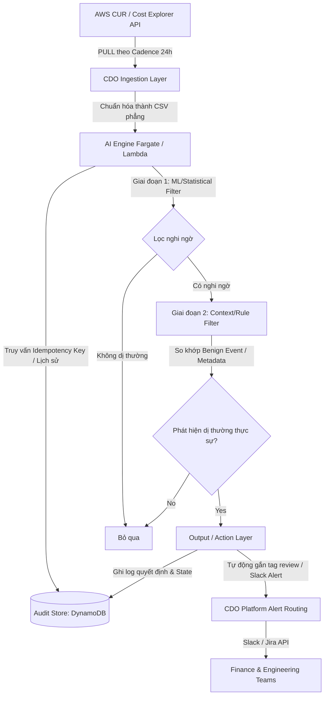

# Solution Design - FinOps Watch (tf2_finops_learner)

<!-- Doc owner: Nhóm AI
     Status: Draft (W11 T3)
     Word target: 1000-2000 từ -->,

## 1. High-level architecture

Hệ thống FinOps Watch hoạt động theo mô hình **Scheduled Batch** được kích hoạt tự động theo chu kỳ 24 giờ. Luồng xử lý đi từ việc thu thập dữ liệu chi phí thô, chuẩn hóa, phân tích dị thường hai giai đoạn và tự động thực thi các hành động ngăn chặn an toàn.

*Diagram caption: Luồng xử lý định kỳ của FinOps Watch. CDO kéo dữ liệu thô và chuẩn hóa trước khi gọi AI Engine. AI Engine sử dụng quy trình phát hiện 2 giai đoạn (ML + Quy tắc/Ngữ cảnh) kết hợp DynamoDB để khóa chạy trùng lặp (Idempotency) và lưu vết kiểm toán (Audit Trail) phục vụ Rollback.*

## 2. Component breakdown

| Component | Responsibility | Tech choice | Why |
|---|---|---|---|
| **Ingestion Layer** | Kéo dữ liệu từ AWS Cost Explorer API và CUR S3. Chuẩn hóa dữ liệu thành các tệp bảng phẳng daily grain. | **AWS EventBridge + Lambda / Glue** (CDO quản lý) | EventBridge cron đáng tin cậy cho batch job. Lambda/Glue xử lý ETL chuyển CUR thành CSV phẳng hiệu quả và tiết kiệm. |
| **AI Engine** | Phân tích dị thường 2 giai đoạn (Statistical/ML Filter + Context Rule Filter) để đưa ra quyết định cảnh báo & containment. | **AWS ECS Fargate / Lambda** (AI triển khai) | Đáp ứng khả năng chạy batch định kỳ tự động, cô lập môi trường tốt, dễ tích hợp với mô hình ML/Python và tối ưu chi phí (chỉ tốn tiền khi chạy). |
| **Audit Store** | Lưu vết các quyết định của AI, trạng thái tài nguyên trước/sau can thiệp, rollback path, và các khóa idempotency. | **Amazon DynamoDB + S3 Standard/Glacier Archive** | DynamoDB hỗ trợ truy vấn độ trễ mili-giây cho UI Dashboard, cơ chế tự động dọn dẹp bằng TTL 90 ngày. S3 Glacier dùng để lưu trữ log kiểm toán lâu dài (compliance). |
| **Output / Action** | Gửi cảnh báo định tuyến (Slack/Jira) và thực hiện các hành động ngăn chặn an toàn (containment actions). | **AWS SDK + Slack/Jira API** (CDO & AI phối hợp) | AWS SDK hỗ trợ gắn tag/stop tài nguyên nhanh chóng. Slack/Jira API giúp tích hợp thông báo trực tiếp vào luồng công việc của Finance và Engineering. |

## 3. Data flow (step-by-step)

1. **Bước 1: Trigger định kỳ**
   EventBridge Cron kích hoạt CDO Ingestion Layer chạy vào một giờ cố định mỗi ngày (ví dụ: 01:00 AM UTC).
2. **Bước 2: Ingest & Chuẩn hóa**
   CDO Platform kéo dữ liệu từ CUR (S3) và Cost Explorer API. Chuẩn hóa dữ liệu thô thành tệp CSV phẳng (daily grain) và lưu trữ trên S3 tạm thời.
3. **Bước 3: Khởi chạy AI Engine**
   CDO gọi AI Engine (ECS Task hoặc Lambda), truyền vào các tham số: `data_s3_path`, `run_date` và `idempotency_key` (`Hash(run_date + account_id + service)`).
4. **Bước 4: Kiểm tra chống chạy trùng (Idempotency check)**
   AI Engine nhận yêu cầu, truy vấn DynamoDB bằng `idempotency_key`. Nếu đã tồn tại bản ghi ở trạng thái `SUCCESS`, AI Engine lập tức kết thúc lượt chạy (skip). Nếu chưa có, tiến hành phân tích.
5. **Bước 5: Phát hiện dị thường hai giai đoạn**
   * **Giai đoạn 1 (ML Filter)**: Chạy mô hình thống kê nhẹ (ví dụ: Rolling Z-Score hoặc Isolation Forest) trên cột `unblended_cost` để phát hiện các đột biến chi phí.
   * **Giai đoạn 2 (Context Filter)**: Các điểm nghi ngờ được đối chiếu với danh sách sự kiện nghiệp vụ hợp lệ (bẫy FP như load test, flash-sale) và kiểm tra thẻ tag. Điểm dị thường thực sự sẽ được tính `confidence_score`.
6. **Bước 6: Ghi log Audit & Kích hoạt Containment**
   * Hệ thống ghi snapshot trạng thái tài nguyên trước khi can thiệp (`before_state`), payload rollback (`rollback_path`) cùng `idempotency_key` vào DynamoDB.
   * Thực hiện hành động gắn thẻ cảnh báo (`tag-for-review`) trên tài nguyên.
7. **Bước 7: Định tuyến cảnh báo (Alert Routing)**
   Kết quả dị thường được gửi về CDO để đẩy qua Slack/Jira theo đúng kênh: Finance (cost leak lâu ngày, untagged) vs Engineering (sudden spike hạ tầng kỹ thuật).

## 4. Alternatives considered (KEY)

### 4.1 AI Pattern: Pure Statistical vs Pure LLM vs Hybrid

- **Option A (Pure Statistical/ML)**: Sử dụng các mô hình Z-Score, Isolation Forest quét trực tiếp dữ liệu chi phí.
  * *Pros*: Chạy cực nhanh, chi phí vận hành rẻ, dễ lập trình và backtest.
  * *Cons*: Không hiểu ngữ cảnh nghiệp vụ, dẫn đến tỷ lệ báo động giả (FP rate) rất cao khi gặp các sự kiện hợp lệ (load test, flash sale).
- **Option B (Pure LLM Agent)**: Nạp toàn bộ dữ liệu CUR chi tiết vào LLM và yêu cầu phát hiện.
  * *Pros*: Hiểu sâu các tag, phát hiện được các lỗi logic nghiệp vụ.
  * *Cons*: Chi phí gọi API khổng lồ (25,000 dòng CUR), tốc độ phản hồi chậm, rủi ro ảo giác (hallucination).
- **Chosen: Option C (Hybrid Architecture)**: Lọc thô bằng mô hình thống kê/ML (loại bỏ 95% dữ liệu bình thường), sau đó dùng bộ quy tắc (Rule-based) phối hợp với LLM Agent (chỉ phân tích <5% điểm nghi ngờ).
  * *Reason*: Giữ chi phí vận hành ở mức tối thiểu, tốc độ xử lý nhanh, đáp ứng cam kết Precision ≥80% và FP ≤10% nhờ loại bỏ hiệu quả các "bẫy FP".

### 4.2 Chu kỳ quét dữ liệu (Ingestion & Detection Cadence)

- **Option A (12 giờ)**: Quét dữ liệu 2 lần mỗi ngày.
  * *Pros*: Phát hiện nhanh các đột biến chi phí cực lớn.
  * *Cons*: Dữ liệu CUR/Cost Explorer cập nhật rất chậm từ phía AWS (thường trễ 12-24h). Quét mỗi 12h sẽ gặp nhiều dữ liệu ước tính thô (`is_estimated = true`) chưa ổn định, gây tăng đột biến tỷ lệ báo giả (FP) và dễ bị khóa API (Rate Limit).
- **Option B (48 giờ)**: Quét dữ liệu 2 ngày một lần.
  * *Pros*: Tiết kiệm chi phí gọi API, dữ liệu chi phí đã ổn định (finalized).
  * *Cons*: Trễ quá lâu. Một cluster quên tắt ($400/ngày) chạy suốt 48h sẽ gây thất thoát ít nhất $800 trước khi bị phát hiện.
- **Chosen: Option C (24 giờ / Daily)**: Quét dữ liệu 1 lần mỗi ngày.
  * *Reason*: Khớp hoàn hảo với chu kỳ cập nhật dữ liệu tự nhiên của AWS và cấu trúc tệp dữ liệu thực tế. Đảm bảo phát hiện lỗi quên tắt trong vòng 24h (mất tối đa $400 thay vì $800) trong khi vẫn duy trì API limit an toàn.

### 4.3 Công nghệ lưu trữ Audit Trail

- **Option A (S3 + Athena)**: Ghi trực tiếp log hành động ra file JSON trên S3 và dùng Athena để truy vấn.
  * *Pros*: Chi phí lưu trữ cực rẻ cho chu kỳ >90 ngày, dễ mở rộng.
  * *Cons*: Độ trễ truy vấn cao, không phù hợp cho việc hiển thị real-time trạng thái trên Dashboard UI hoặc kiểm tra Idempotency Key nhanh chóng.
- **Chosen: Option B (DynamoDB + S3 Archive)**: Lưu trữ các hành động và trạng thái rollback chủ động trong DynamoDB sử dụng TTL 90 ngày để tự động xóa. Dữ liệu hết hạn sẽ được stream lưu trữ dài hạn tại S3.
  * *Reason*: Hỗ trợ Dashboard truy vấn mili-giây, dễ dàng kiểm tra idempotency, thực hiện rollback tự động bằng cách đọc trực tiếp API payload được lưu sẵn trong DynamoDB.

## 5. Risk + mitigation

| Risk | Likelihood | Impact | Mitigation |
|---|---|---|---|
| **AI báo sai (False Positive) trên các sự kiện hợp lệ** | Medium | Medium | Áp dụng bộ lọc ngữ cảnh (Context Filter) đối chiếu với lịch sự kiện kinh doanh đã biết (Load test, migration, flash sale) trước khi đưa ra quyết định cuối cùng. |
| **Hành động containment tự động gây ảnh hưởng môi trường Prod** | Low | High | • **Thiết kế ranh giới cứng**: Tuyệt đối cấm hành động Stop/Terminate trên Prod Accounts (`prod-core`, `prod-payments`). • Ở Prod, hệ thống chỉ chạy ở chế độ **Dry-run** (gắn tag review/gửi alert) để người vận hành phê duyệt thủ công. |
| **AWS Cost Explorer API bị Rate Limit (Throttle)** | Medium | Medium | Triển khai cơ chế exponential backoff kèm jitter trong mã nguồn của CDO/AI Engine. Sử dụng chu kỳ quét 24h để hạn chế số lần gọi API. |
| **Rò rỉ dữ liệu chi phí giữa các Linked Accounts** | Low | High | Phân quyền IAM chi tiết ở cấp độ Account. AI Engine phân tích dữ liệu tách biệt theo từng `account_id` và áp dụng cơ chế cô lập ngữ cảnh (context isolation). |

## 6. Open design questions

- [ ] **Q1**: Có nên xây dựng cơ chế phản hồi (Feedback Loop) ngay trên Slack để Finance/Ops có thể đánh dấu "Hợp lệ" (Mark as Benign) cho một cảnh báo, từ đó tự động cập nhật vào danh sách loại trừ của AI Engine hay không? *Dự kiến thống nhất vào T4 W11*.
- [ ] **Q2**: Ngưỡng độ lệch (deviation threshold) cho mô hình thống kê nên được thiết lập tĩnh chung cho toàn bộ hệ thống hay động (dynamic) theo từng Account/Service để tránh nhiễu ở các account dev nhỏ?

## Related documents

- **03_ai_engine_spec.md** - Chi tiết kiến trúc AI engine + thuật toán + an toàn bảo mật
- [README.md](../../data/tf2-finops/README.md) - Tài liệu chi tiết về bộ dữ liệu backtest 3 tháng
- [TF2_FINOPS_LEARNER.md](../../reference/TF2_FINOPS_LEARNER.md) - Tài liệu bối cảnh và yêu cầu từ phía Khách hàng (CFO)
